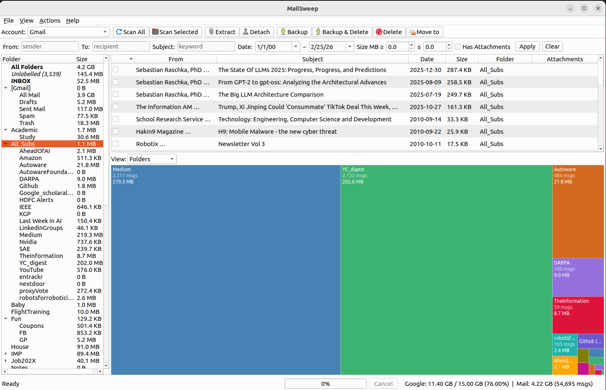
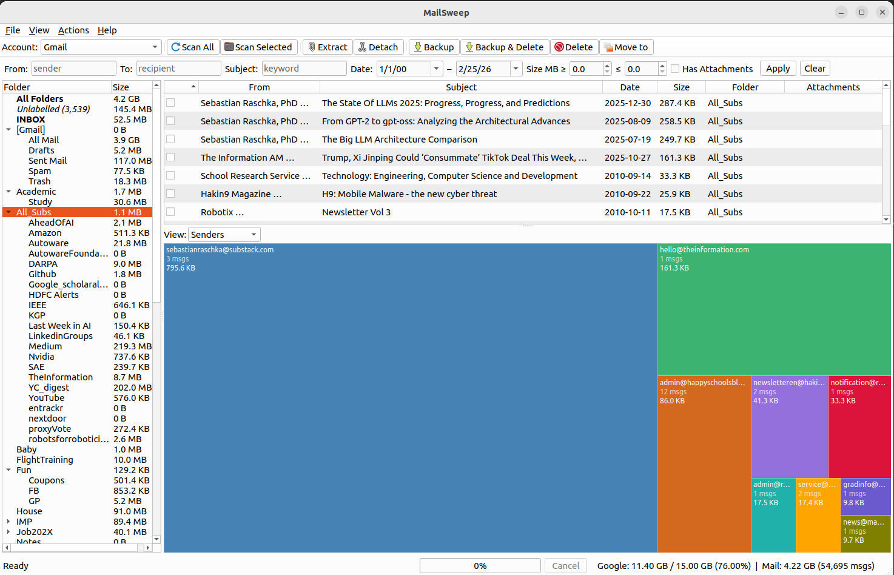
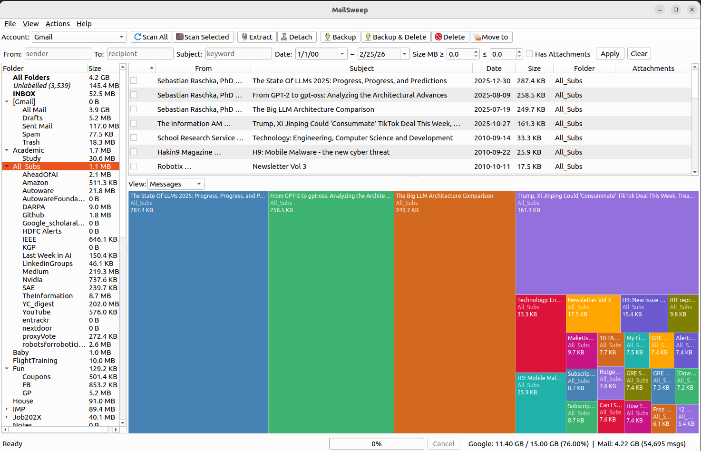
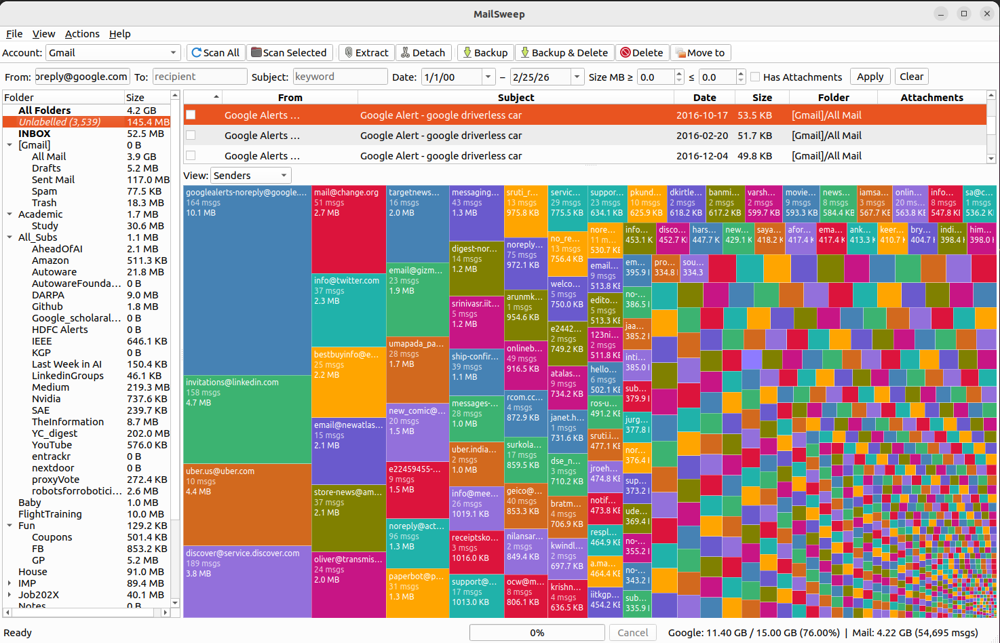
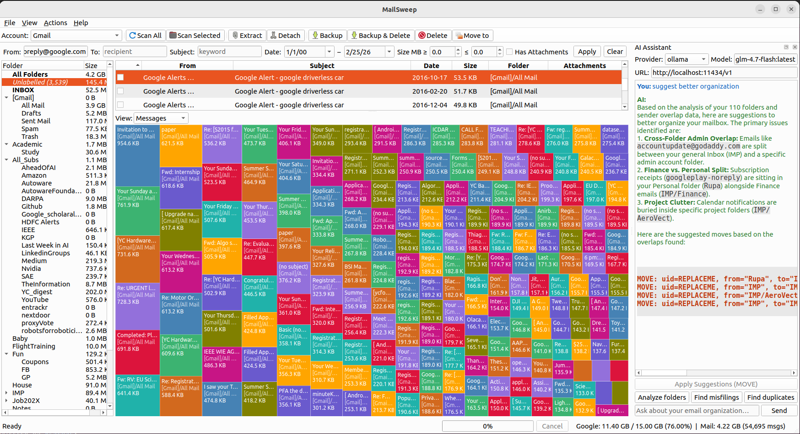
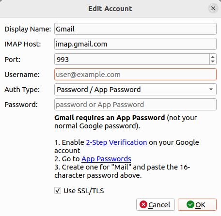
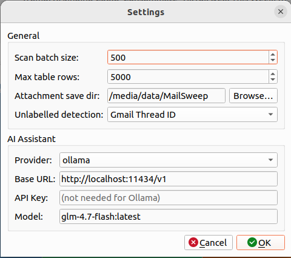

# MailSweep

**IMAP Mailbox Analyzer & Cleaner** — like WinDirStat/Baobab for your email.

Visualize where your email storage is going, then surgically reclaim it with
bulk attachment extraction, detach, backup, and delete operations.


## Screenshots

### Treemap Views

| Folders | Senders | Messages |
|---------|---------|----------|
|  |  |  |

### Unlabelled Messages

| By Sender | By Message |
|-----------|------------|
|  |  |

### AI Assistant & Settings

| AI Suggestions | Account Settings | Settings |
|----------------|------------------|----------|
|  |  |  |

## Features

- **Treemap visualization** — see which folders, senders, or messages consume the most space
- **Folder drill-down** — click into sub-labels, explore messages inside any folder
- **Bulk attachment extraction** — save attachments locally without modifying server messages
- **Attachment detach** — strip attachments from server messages, replace with placeholder text showing local file path
- **Backup to .eml** — download full messages as RFC822 files
- **Backup & delete** — backup then safely remove from server (Gmail-safe: copies to Trash first)
- **Smart size display** — deduplicates Gmail labels so total size reflects actual storage usage
- **IMAP quota** — shows server-reported storage usage and limit
- **Incremental scan** — rescan only fetches new/changed messages using UIDVALIDITY
- **OAuth2 support** — Gmail (XOAUTH2) and Outlook (MSAL), plus password/app-password auth
- **Filter bar** — filter by sender, subject, date range, size range, attachment presence
- **AI assistant** — LLM-powered mailbox analysis (Ollama, LM Studio, OpenAI, Anthropic) with dynamic model dropdowns and Refresh to discover local models; find misfilings, dead folders, sender overlap; apply AI-suggested IMAP moves with one click

## Installation

```bash
# Clone and install
git clone https://github.com/jitrc/MailSweep.git
cd mailsweep
uv sync --dev

# Run the GUI
uv run mailsweep

# Run the CLI (prints folder sizes, no GUI)
uv run mailsweep-cli --host imap.gmail.com --username you@gmail.com
```

### Requirements

- Python 3.11+
- [uv](https://docs.astral.sh/uv/) package manager (recommended) or pip

## Quick Start

1. Launch: `uv run mailsweep`
2. Click **Add Account** and enter your IMAP server details
3. Click **Scan Mailbox** to fetch message metadata (no message bodies downloaded)
4. Browse the treemap, filter bar, and folder tree to explore your mailbox
5. Select messages and use the toolbar or right-click menu for operations

### Gmail Setup

**Recommended:** Use **Auth Type: Password** with a
[Gmail App Password](https://myaccount.google.com/apppasswords)
(requires 2-Step Verification). No cloud project needed.

**OAuth2 alternative:** Create credentials in
[Google Cloud Console](https://console.cloud.google.com/) >
APIs & Services > Credentials > OAuth 2.0 Client ID (Desktop app type).

### Other Providers

| Provider | Host | Port | Auth |
|----------|------|------|------|
| Gmail | imap.gmail.com | 993 | App Password or OAuth2 |
| Outlook | outlook.office365.com | 993 | Password or OAuth2 |
| Yahoo | imap.mail.yahoo.com | 993 | App Password |
| ProtonMail | 127.0.0.1 | 1143 | Bridge password |
| Fastmail | imap.fastmail.com | 993 | App Password |

## Feature Guide

### Treemap Visualization

The treemap at the bottom of the window shows your mailbox as a proportional area chart —
bigger tiles mean more storage consumed. It updates instantly when you select a folder or
change the view mode.

**View modes** (tabs above the treemap):

| Mode | What each tile represents | Best used for |
|------|--------------------------|---------------|
| **Folders** | One tile per folder/label, sized by total message bytes | Finding which folders are bloated |
| **Senders** | One tile per unique sender email, sized by total bytes from that sender | Identifying who is flooding your inbox with large mail |
| **Receivers** | One tile per recipient address, sized by total bytes to that address | Useful in Sent folders to see who you send large mail to |
| **Messages** | One tile per individual message, sized by message size | Finding the single largest messages to delete |

**Drill-down (Folders mode):** Click any folder tile to zoom into its sub-labels. Click a
leaf folder to see its top individual messages. Click **All Folders** in the left tree to
zoom back out.

**Click to filter:** Clicking a sender or receiver tile in the treemap automatically populates
the filter bar so only messages from/to that address are shown in the message table.

---

### Sender / Receiver Column

The message table shows either a **From** or **To** column depending on which folder you are
viewing:

- **From** (default) — shows who sent the message. Useful for Inbox, newsletters, any folder
  where you are the recipient.
- **To** — shown automatically when you select a Sent folder (MailSweep detects folder names
  like "Sent", "Sent Mail", "Sent Items"). Useful to see who you emailed and how much storage
  those sent messages occupy.

You can toggle between From and To manually using the **From / To** button in the toolbar.
MailSweep remembers your choice per folder for the session.

---

### Unlabelled Messages (Gmail)

Gmail uses labels rather than folders. Every message lives in **All Mail** and is tagged with
one or more labels (Inbox, Starred, your custom labels, etc.). A message is **unlabelled** when
it exists in All Mail but carries no label that maps to a visible folder — it was archived
directly without any label, so it never shows up in your normal folder browsing.

**Why it matters:** Unlabelled messages are invisible in the standard Gmail interface unless you
search `in:all`. Over years of archiving, these can accumulate into gigabytes of storage you
cannot easily find or clean.

**How to use it:** After scanning, an **Unlabelled** item appears in the folder tree (italic,
below All Folders). Clicking it loads only these hidden messages. You can then filter, sort by
size, and bulk-delete or backup them.

**Detection modes** (Settings → Unlabelled detection):

| Mode | How it works | When to use |
|------|-------------|-------------|
| **No thread matching** | A message is unlabelled if its exact Message-ID does not appear in any other label folder | Fast, accurate for most cases |
| **In-Reply-To chain** | Also considers a message labelled if any message in the same reply thread has a label | Reduces false positives when only the first reply is labelled |
| **Gmail Thread ID** | Uses Gmail's native X-GM-THRID to group threads; unlabelled if the entire thread has no label | Most accurate for Gmail, requires a Gmail account |

> **Note:** Unlabelled detection requires All Mail to be enabled. If you have disabled All Mail
> in Settings, this feature will not work.

---

### Finding Duplicate Labels (Cross-Label Duplicates)

**Actions → Find Duplicate Labels**

Gmail labels let the same physical message appear in multiple label-folders simultaneously
(e.g., a message in both Inbox and a custom label shows up twice when scanning). This tool
finds messages stored under two or more labels and shows them grouped together.

**Why it matters:** When you export or analyse your mailbox, duplicate labels inflate apparent
size. More importantly, if you manually created duplicate copies (e.g., by forwarding to yourself
or by having filters file into multiple labels), this surfaces them for cleanup.

**All Mail is skipped by default** — every labelled message also appears in All Mail, so
including it would make every message look like a duplicate. MailSweep asks whether to skip it
automatically; if you have disabled All Mail in Settings it is always excluded.

**How to use it:**
1. Run **Actions → Find Duplicate Labels**
2. The table shows each group of duplicates with a "N labels" badge
3. Sort by size, identify the copies you do not need
4. Select and delete the extras — the message is only truly removed when all copies are deleted

---

### Finding Detached Duplicates

**Actions → Find Detached Duplicates**

When you use MailSweep's **Detach Attachments** operation (or Thunderbird's equivalent), the
original large message is replaced with a lightweight version. However, the original sometimes
survives in another folder — typically **All Mail** on Gmail, or alongside the detached copy
in the same folder on other providers.

This tool finds pairs of messages where:
- Both copies have the same sender, subject, and date
- One is significantly larger than the other (the original with the attachment still intact)

**Why it matters:** The whole point of detaching is to save space. If the bloated original is
still sitting in All Mail, you have not saved anything. This scan surfaces those orphaned
originals so you can delete them and actually reclaim the storage.

**How to use it:**
1. Run **Actions → Find Detached Duplicates**
2. Each row is tagged **Original** or **Detached Copy**
3. Review the pairs — confirm the smaller copy has the placeholder text you expect
4. Select the **Original** rows and delete them to reclaim space

> **Note:** Finding detached duplicates in All Mail requires All Mail to be enabled in Settings.

---

### AI Assistant

**View → Show AI Assistant**

The AI assistant analyses your mailbox and suggests actions in plain English. It works
entirely from the local SQLite cache — no message bodies are sent to the LLM, only
aggregated statistics (folder sizes, top senders, cross-folder overlap, inactive folders).

**When to use it:**

| Situation | What to ask |
|-----------|-------------|
| You have hundreds of folders and do not know where to start | Ask "which folders are wasting the most space?" |
| A sender you don't recognise is consuming gigabytes | Ask "who are the top senders by size and should I unsubscribe?" |
| You suspect some folders are redundant or overlap | Ask "are there senders who appear in multiple folders?" or "which folders seem dead?" |
| You want suggested cleanup rules | Ask "suggest a cleanup plan for my mailbox" |
| You want to reorganise labels | Ask "which messages in Inbox belong in a specific label?" |

**Applying suggestions:** When the AI suggests moving messages to a different folder,
an **Apply Moves** button appears. Clicking it executes the IMAP moves directly — MailSweep
handles the folder creation and move commands, and you confirm each batch before anything changes.

**Provider setup** (Settings → AI Assistant):

| Provider | Base URL | Key needed | Best for |
|----------|----------|-----------|---------|
| Ollama | http://localhost:11434/v1 | No | Free, private, runs locally |
| LM Studio | http://localhost:1234/v1 | No | Free, private, runs locally |
| OpenAI | (auto-filled) | Yes | GPT-4o, most capable cloud option |
| Anthropic | (auto-filled) | Yes | Claude, strong reasoning |
| Custom | Any OpenAI-compatible URL | Optional | Self-hosted or proxy endpoints |

Use the **Refresh** button next to the model dropdown to discover all models currently
loaded on your local Ollama or LM Studio instance.

---

### All Mail (Gmail) — Disable Option

Gmail's All Mail folder is a virtual folder containing every message regardless of label.
Scanning it doubles the apparent size of your mailbox and can cause confusion in counts,
treemaps, and duplicate searches since every message appears at least twice.

**Settings → Disable All Mail folder** excludes All Mail from:
- Syncing (it is never scanned)
- Folder tree and size counts
- Treemap visualization
- Message table queries when "All Folders" is selected
- Duplicate label and detached duplicate searches

> **Trade-off:** Disabling All Mail means Unlabelled email detection and Find Detached Duplicates
> will not work, since both rely on All Mail as the source of truth for archived messages.

---

## Operations

| Operation | Server Modified? | Description |
|-----------|-------------------|-------------|
| **Extract Attachments** | No | Save attachments to local disk |
| **Detach Attachments** | Yes | Save locally + replace attachment in message with placeholder |
| **Backup** | No | Download full message as .eml file |
| **Backup & Delete** | Yes | Download .eml then move message to Trash |
| **Delete** | Yes | Move message to Trash (Gmail-safe) |
| **AI Move** | Yes | LLM suggests moves → user confirms → messages moved via IMAP |

### Extract vs Detach

Both operations save attachments to your local disk, but they differ in what happens to the server message:

**Extract Attachments** — read-only. The attachment is copied to disk and the original message on the server is left completely untouched. Use this when you want a local copy of a file but still want the full message to remain in your mailbox (e.g. contracts, receipts you may need to forward).

**Detach Attachments** — modifies the server. The attachment is saved locally, then the message on the server is rewritten: the attachment part is replaced with a small text/plain placeholder that records the local file path. The message subject, body text, and metadata are preserved. Use this to permanently reclaim storage — a 10 MB PDF attachment becomes a few hundred bytes on the server while the file lives on your disk.

> After detaching, run **Actions → Find Detached Duplicates** to catch any orphaned originals that survived in other folders (common on Gmail's All Mail).

### Backup vs Backup & Delete

**Backup** — downloads the complete message as a standard `.eml` file (RFC 822 format, openable in any email client) and leaves the server message intact. Use this to archive important messages locally before cleaning up, or to migrate mail between providers.

**Backup & Delete** — same download, then immediately moves the message to Trash. This is the safe way to remove messages you want to keep a local copy of. On Gmail, the move goes to `[Gmail]/Trash` rather than expunging directly, so there is a recovery window before Gmail permanently deletes it.

## Data Locations

| Item | Path |
|------|------|
| SQLite cache | `~/.local/share/mailsweep/mailsweep.db` |
| Settings | `~/.config/mailsweep/settings.json` |
| Saved attachments | `~/MailSweep_Attachments/` |
| Backup .eml files | `~/MailSweep_Attachments/backups/` |
| App log | `~/.local/share/mailsweep/mailsweep.log` |

All paths follow XDG Base Directory conventions. The save directory can be
changed in Settings.

## Development

```bash
# Run tests
uv run pytest

# Lint
uv run ruff check mailsweep/

# Type check
uv run mypy mailsweep/
```

## How It Works

- **Scan** uses `FETCH [ENVELOPE, RFC822.SIZE, BODYSTRUCTURE]` — gets sender, subject, date,
  size, and full MIME tree without downloading any message bodies. Batched in groups of 500 UIDs.
- **Incremental rescan** checks `UIDVALIDITY`, then diffs server UIDs vs cache to fetch only new messages.
- **Attachment detach** parses the full RFC822 message with Python's `email` library (compat32 policy
  for safe re-upload), replaces attachment parts with text/plain placeholders, then APPENDs the
  cleaned message back to the same folder and expunges the original.
- **Gmail-safe delete** copies messages to `[Gmail]/Trash` before expunging, preventing permanent
  deletion on Gmail where `\Deleted` + `EXPUNGE` on `[Gmail]/All Mail` bypasses Trash entirely.
- **Credentials** are stored in the system keychain via the `keyring` library (Secret Service on
  Linux, Keychain on macOS, Credential Manager on Windows). Never stored in files or logged.
- **AI assistant** uses stdlib `urllib.request` to call LLM APIs (zero new dependencies). Builds a
  markdown context from the SQLite cache (folder tree, top senders, cross-folder overlap, dead folders)
  and sends it as system prompt. Supports Ollama, LM Studio (local), OpenAI, and Anthropic.
  Model dropdowns are pre-populated per provider; a Refresh button discovers models from local
  servers via the `/v1/models` endpoint. IMAP moves use RFC 6851 `MOVE` with
  `COPY`+`DELETE`+`EXPUNGE` fallback.

## Author

Jit Ray Chowdhury

## License

MIT
